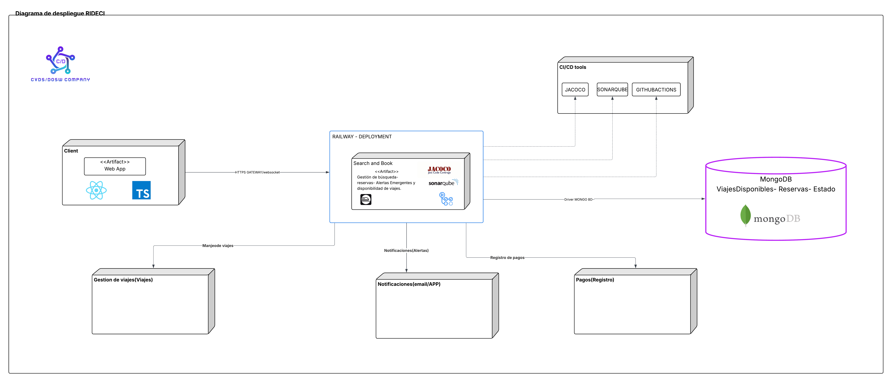
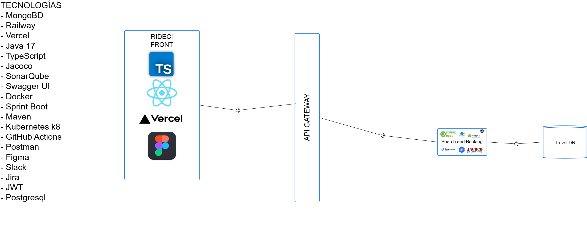
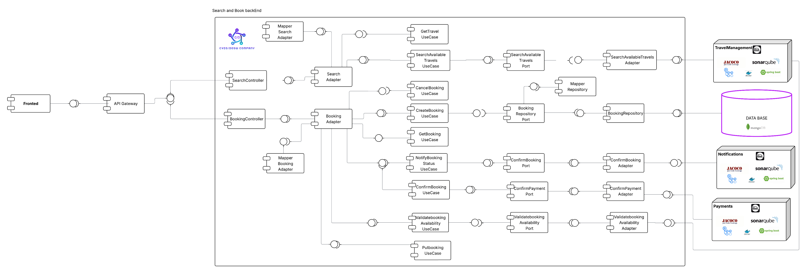
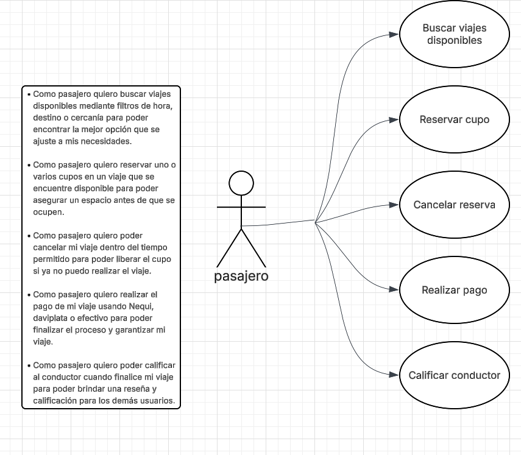
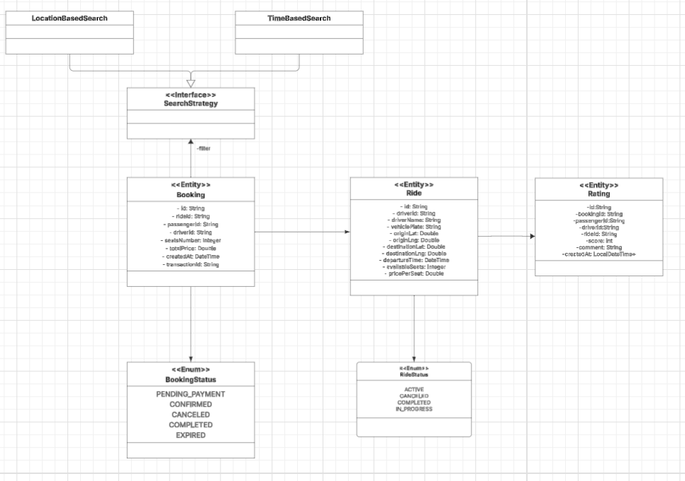

# POSEIDON_SEARCH_AND_BOOKING


## Desarrolladores

* Deisy Lorena Guzman Cabrales
* Diego Fernando Chavarro Castillo
* Oscar Andres Sanchez Porras
* Samuel Leonardo Albarrachin Vergara
* Sergio Alejandro Idarraga

---

## Tabla de Contenidos

* [ Estrategia de Versionamiento y Branching](#-estrategia-de-versionamiento-y-branching)

  * [ Estrategia de Ramas (Git Flow)](#-estrategia-de-ramas-git-flow)
  * [ Convenciones de Nomenclatura](#-convenciones-de-nomenclatura)
  * [ Convenciones de Commits](#-convenciones-de-commits)
* [ Arquitectura del Proyecto](#-arquitectura-del-proyecto)

  * [ Estructura de Capas](#️-estructura-de-capas)
* [ Tecnologías Utilizadas](#️-tecnologías-utilizadas)
* [ Arquitectura Limpia - Organización de Capas](#️-arquitectura-limpia---organización-de-capas)
* [Diagramas del Módulo](#diagramas-del-módulo)


---

##  Estrategia de Versionamiento y Branching

Se implementa una estrategia de versionamiento basada en **GitFlow**, garantizando un flujo de desarrollo **colaborativo, trazable y controlado**.

###  Beneficios:

- Permite trabajo paralelo sin conflictos
- Mantiene versiones estables y controladas
- Facilita correcciones urgentes (*hotfixes*)
- Proporciona un historial limpio y entendible

---

##  Estrategia de Ramas (Git Flow)

| **Rama**                | **Propósito**                            | **Recibe de**           | **Envía a**        | **Notas**                      |
| ----------------------- | ---------------------------------------- | ----------------------- | ------------------ | ------------------------------ |
| `main`                  | Código estable para PREPROD o Producción | `release/*`, `hotfix/*` | Despliegue         | Protegida con PR y CI exitoso  |
| `develop`               | Rama principal de desarrollo             | `feature/*`             | `release/*`        | Base para integración continua |
| `feature/*`             | Nuevas funcionalidades o refactors       | `develop`               | `develop`          | Se eliminan tras el merge      |
| `release/*`             | Preparación de versiones estables        | `develop`               | `main` y `develop` | Incluye pruebas finales        |
| `bugfix/*` o `hotfix/*` | Corrección de errores críticos           | `main`                  | `main` y `develop` | Parches urgentes               |

---

##  Convenciones de Nomenclatura

### Feature Branches

```
feature/[nombre-funcionalidad]-hades_[codigo-jira]
```

**Ejemplos:**

```
- feature/authentication-module-hades_23
- feature/security-service-hades_41
```

**Reglas:**

*  Formato: *kebab-case*
*  Incluir código Jira
*  Descripción breve y clara
*  Longitud máxima: 50 caracteres

---

### Release Branches

```
release/[version]
```

**Ejemplos:**

```
- release/1.0.0
- release/1.1.0-beta
```

---

### Hotfix Branches

```
hotfix/[descripcion-breve-del-fix]
```

**Ejemplos:**

```
- hotfix/fix-token-expiration
- hotfix/security-patch
```

---

## Convenciones de Commits

### Formato Estándar

```
[codigo-jira] [tipo]: [descripción breve de la acción]
```

**Ejemplos:**

```
45-feat: agregar validación de token JWT
46-fix: corregir error en autenticación por roles
```

---

### Tipos de Commit

| **Tipo**   | **Descripción**                      | **Ejemplo**                                     |
| ----------- | ------------------------------------ | ----------------------------------------------- |
| `feat`      | Nueva funcionalidad                  | `22-feat: implementar autenticación con JWT`    |
| `fix`       | Corrección de errores                | `24-fix: solucionar error en endpoint de login` |
| `docs`      | Cambios en documentación             | `25-docs: actualizar README con nuevas rutas`   |
| `refactor`  | Refactorización sin cambio funcional | `27-refactor: optimizar servicio de seguridad`  |
| `test`      | Pruebas unitarias o de integración   | `29-test: agregar tests para AuthService`       |
| `chore`     | Mantenimiento o configuración        | `30-chore: actualizar dependencias de Maven`    |


**Reglas:**

* Un commit = una acción completa
* Máximo **72 caracteres** por línea
* Usar modo imperativo (“agregar”, “corregir”, etc.)
* Descripción clara de qué y dónde
* Commits pequeños y frecuentes

---

## Arquitectura del Proyecto

El backend de **POSEIDON_SEARCH_AND_BOOKING** sigue una **arquitectura limpia y desacoplada**, priorizando:

* Separación de responsabilidades
* Mantenibilidad
* Escalabilidad
* Facilidad de pruebas

---

## Estructura de Capas

```
📂 poseidon_backend
 ┣ 📂 domain/
 ┃ ┣ 📄 Entities/
 ┃ ┣ 📄 ValueObjects/
 ┃ ┣ 📄 Enums/
 ┃ ┣ 📄 Services/
 ┃ ┗ 📄 Events/
 ┣ 📂 application/
 ┃ ┣ 📄 UseCases/
 ┃ ┣ 📄 DTOs/
 ┃ ┣ 📄 Mappers/
 ┃ ┗ 📄 Exceptions/
 ┣ 📂 infrastructure/
 ┃ ┣ 📄 Controllers/
 ┃ ┣ 📄 Database/
 ┃ ┣ 📄 Repositories/
 ┃ ┣ 📄 Config/
 ┃ ┗ 📄 Security/
 ┗ 📄 pom.xml
```

---

## Tecnologías Utilizadas

| **Categoría**              | **Tecnologías**                           |
| -------------------------- | ----------------------------------------- |
| **Backend**                | Java 17, Spring Boot, Maven               |
| **Base de Datos**          | MongoDB, PostgreSQL                       |
| **Infraestructura**        | Docker, Kubernetes (K8s), Railway, Vercel |
| **Seguridad**              | JWT, Spring Security                      |
| **Integración Continua**   | GitHub Actions, Jacoco, SonarQube         |
| **Documentación y Diseño** | Swagger UI, Figma                         |
| **Comunicación y Gestión** | Slack, Jira                               |
| **Testing**                | Postman                                   |

---

## Arquitectura Limpia - Organización de Capas

### DOMAIN (Dominio)

Representa el **núcleo del negocio**, define **qué hace el sistema, no cómo lo hace**.
Incluye entidades, objetos de valor, enumeraciones, interfaces de repositorio y servicios de negocio.

### APPLICATION (Aplicación)

Orquesta la lógica del negocio a través de **casos de uso**, **DTOs**, **mappers** y **excepciones personalizadas**.

### INFRASTRUCTURE (Infraestructura)

Implementa los **detalles técnicos**: controladores REST, persistencia, configuración, seguridad y conexión con servicios externos.

---

## Diagramas del Módulo


## Diagrama de Contexto


---

### Diagrama de Despliegue



Este diagrama muestra la arquitectura de despliegue del módulo **Search and Book**, incluyendo cómo interactúan el cliente, el backend principal, los microservicios externos, la base de datos MongoDB y las herramientas CI/CD.


####  Cliente (Front-End Web App)

La aplicación cliente está desarrollada con:

- **React**
- **TypeScript**

Se comunica con el backend mediante:

- **HTTPS**
- **WebSockets**

Desde aquí el usuario realiza búsquedas, reservas y recibe actualizaciones en tiempo real.

#### **Search and Book**
Responsabilidades:
- Gestión de búsqueda de viajes  
- Administración de reservas  
- Alertas emergentes  
- Manejo de disponibilidad de viajes  
- Comunicación con otros servicios del ecosistema  

Tecnologías internas:
- **Spring Boot**
- **Jacoco** (cobertura)
- **SonarQube** (análisis de calidad)
- **Docker**

Este backend actúa como punto central entre el cliente, la base de datos y los microservicios.


#### Microservicios Externos

 **a) Gestión de Viajes (Viajes)**
- Maneja la disponibilidad y administración de los viajes.
- Recibe solicitudes del módulo Search and Book.

**b) Notificaciones (Email/App)**
- Envía correos, alertas y notificaciones.
- Recibe eventos del backend Search and Book.

**c) Pagos (Registro)**
- Administra el registro de pagos.
- Se integra para almacenar transacciones relacionadas con reservas.


#### Base de Datos — MongoDB

El módulo Search and Book se conecta directamente a **MongoDB** mediante el driver oficial.

Datos almacenados:
- **Viajes disponibles**
- **Reservas**
- **Estado de cada reserva**

---

### Diagrama de Componentes General



Este diagrama describe los componentes principales, tecnologías y flujo de comunicación del sistema RideCI, orientado a la búsqueda y reserva de viajes.


#### Arquitectura General

La arquitectura está compuesta por:

- **Frontend (RideCI Front)**
- **API Gateway**
- **Microservicio Search and Booking**
- **Base de Datos Travel DB**

#### Frontend – RideCI Front

Desarrollado con:

- **TypeScript**
- **React**
- **Figma** (diseño UI/UX)
- **Vercel** (despliegue)

El frontend se encarga de la interfaz de usuario y se comunica con el sistema mediante el **API Gateway**.


#### API Gateway

El API Gateway centraliza las peticiones del frontend y las distribuye a los microservicios.


#### Microservicio Search and Booking

Este microservicio se encarga de:

- Buscar viajes disponibles
- Gestionar reservas
- Consultar datos de disponibilidad y rutas


#### Base de Datos – Travel DB

La información de viajes y reservas se almacena en **Travel DB**, basada en **MongoDB**


---

### Diagrama de Componentes Específico



Este documento describe la arquitectura interna del microservicio **Search and Booking**, siguiendo los principios de **Clean Architecture** y **Arquitectura Hexagonal (Ports & Adapters)**.  
Incluye controladores, casos de uso, puertos, adaptadores, repositorios e integraciones externas.

####  Flujo General del Sistema

El frontend se comunica con el backend a través de un **API Gateway**.  
El backend procesa peticiones de búsqueda y reserva utilizando casos de uso, conectados mediante puertos y adaptadores hacia la base de datos y microservicios externos.

#### Componentes Internos del Backend

  **Controllers**

Punto de entrada de las solicitudes desde el API Gateway:

- SearchController  
  - Maneja solicitudes de búsqueda y disponibilidad de viajes.

- BookingController  
  - Gestiona creación, cancelación, consulta y actualización de reservas.

---

#### Casos de Uso (Use Cases)

Los casos de uso representan la lógica de negocio del sistema:

**Casos de búsqueda**
- GetTravelUseCase
- SearchAvailableTravelsUseCase

 **Casos de reservas**
- CreateBookingUseCase
- CancelBookingUseCase
- GetBookingUseCase
- PutBookingUseCase
- NotifyBookingStatusUseCase

**Casos de confirmación y pago**
- ConfirmBookingUseCase
- ConfirmPaymentUseCase
- ValidateBookingAvailabilityUseCase
#### Puertos (Ports)

Interfaces que permiten el desacoplamiento entre lógica de negocio y servicios externos:

 Para búsqueda
- SearchAvailableTravelsPort

 Para reservas
- BookingRepositoryPort

Para validaciones
- ValidateBookingAvailabilityPort

 Para confirmaciones
- ConfirmBookingPort
- ConfirmPaymentPort

---

#### Adaptadores 

Implementaciones concretas de los puertos, encargadas de interactuar con sistemas externos:

 Adaptadores de búsqueda
- SearchAdapter
- SearchAvailableTravelsAdapter
- MapperSearchAdapter

 Adaptadores de reservas
- BookingAdapter
- MapperBookingAdapter

Adaptadores de confirmación y pagos
- ConfirmBookingAdapter
- ConfirmPaymentAdapter
- ValidateBookingAvailabilityAdapter

#### Repositorios

Manejadores del acceso a datos y persistencia:

- BookingRepository
- MapperRepository

Ambos implementan los puertos de repositorio necesarios para los casos de uso.

---

#### Integraciones Externas

El servicio se conecta con otros microservicios especializados:

**TravelManagement**
- Consultas de viajes
- Actualización de disponibilidad  
Tecnologías: Spring Boot, Docker, SonarQube, Jacoco

**Notifications**
- Envío de notificaciones sobre estado de reservas  
Tecnologías: Spring Boot, Docker, SonarQube, Jacoco

**Payments**
- Gestión y confirmación de pagos  
Tecnologías: Spring Boot, Docker, SonarQube, Jacoco

#### Base de Datos

La información persistente del sistema se encuentra en:

- **MongoDB** 

Se almacenan datos de:
- Reservas
- Estado de viajes
- Confirmaciones y pagos

---

## Diagrama de Casos de Uso



---

### Diagrama de Clases



---

### Diagrama de Bases de Datos

---


